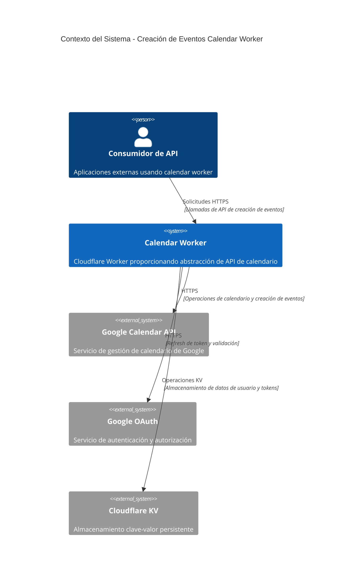

# Documento de Diseño de Software

## 1. Descripción General

### 1.1 Propósito
Este documento especifica el diseño de software para implementar la funcionalidad de creación de eventos de calendario dentro del sistema calendar-worker, habilitando la creación programática de eventos categorizados en Google Calendar a través de una interfaz de API RESTful.

### 1.2 Alcance
El diseño abarca el flujo completo de creación de eventos incluyendo validación de solicitudes, autenticación, transformación de datos, integración con Google Calendar API y formateo de respuestas.

### 1.3 Convenciones del Documento
Este documento sigue el estándar IEEE 1016 para Descripciones de Diseño de Software y emplea diagramas del modelo C4 para representación arquitectónica.

## 2. Alcance

### 2.1 Alcance Funcional
- Creación de eventos de calendario vía endpoint POST /calendar/events
- Sistema de categorización y validación de tipos de eventos
- Soporte multi-calendario con verificación de permisos
- Creación de eventos recurrentes usando patrones RRULE
- Gestión de asistentes e integración de invitaciones
- Configuración de recordatorios y notificaciones

### 2.2 Alcance Técnico
- Implementación TypeScript orientada al runtime de Cloudflare Workers
- Integración con Google Calendar API v3
- Autenticación y autorización OAuth 2.0
- Almacenamiento Cloudflare KV para gestión de sesiones de usuario
- Logging estructurado y generación de trail de auditoría

### 2.3 Fuera del Alcance
- Operaciones de modificación o eliminación de eventos
- Sincronización de calendario en tiempo real
- Soporte multi-proveedor de calendario
- Operaciones masivas de eventos
- Creación de calendarios personalizados

## 3. Definiciones

| Término | Definición |
|---------|------------|
| Tipo de Evento | Clasificación categórica predefinida para eventos de calendario |
| ID de Calendario | Identificador único para instancias de Google Calendar |
| RRULE | Regla de recurrencia siguiendo el estándar RFC5545 |
| Metadata del Worker | Datos adicionales de evento específicos del sistema calendar-worker |
| Access Token | Token OAuth 2.0 para autenticación con Google Calendar API |
| Payload del Evento | Estructura de datos completa para solicitud de creación de evento |

## 4. Supuestos y Restricciones

### 4.1 Supuestos Técnicos
- Google Calendar API v3 mantiene retrocompatibilidad
- Almacenamiento Cloudflare KV proporciona 99.9% de disponibilidad
- Los tokens OAuth 2.0 tienen validez mínima de 3600 segundos
- La latencia de red a Google APIs permanece bajo 500ms
- La zona horaria del usuario por defecto es "America/Santiago"

### 4.2 Supuestos de Negocio
- Los usuarios completan el flujo OAuth con scopes apropiados de calendario
- Los permisos de calendario son gestionados a través del sistema de autorización de Google
- Los tipos de eventos permanecen estables entre versiones del sistema
- Los requisitos de logging de auditoría no exceden las cuotas de almacenamiento

### 4.3 Restricciones Técnicas
- Límite de memoria de 128MB por ejecución de Cloudflare Workers
- Timeout máximo de ejecución de 30 segundos
- Límites de rate de Google Calendar API (10,000 solicitudes por 100 segundos)
- Máximo 100 asistentes por evento (limitación de Google API)
- Duración de evento limitada a 24 horas (excepto eventos de todo el día)

### 4.4 Restricciones Operacionales
- Límite diario de creación de 1000 eventos por usuario
- Requisito de tiempo de respuesta bajo 5 segundos
- Objetivo de disponibilidad de 99.9% para el servicio
- Requisito de cero pérdida de datos para operaciones exitosas

## 5. Contexto del Sistema (C4 - Nivel 1)



## 6. Visión de Arquitectura

### 6.1 Estilo Arquitectónico
El sistema sigue una arquitectura de API RESTful con principios de Clean Architecture, implementando separación de responsabilidades entre las capas de presentación, lógica de negocio y acceso a datos.

### 6.2 Límites del Sistema
La funcionalidad de creación de eventos opera dentro del límite del sistema calendar-worker existente, manteniendo compatibilidad con los mecanismos actuales de autenticación y enrutamiento.

### 6.3 Puntos de Integración
- **Entrante**: Solicitudes HTTP de consumidores de API externos
- **Saliente**: Google Calendar API v3 para operaciones de eventos
- **Almacenamiento**: Cloudflare KV para datos de sesión de usuario
- **Autenticación**: Servicio Google OAuth 2.0

## 7. Diseño de Componentes (C4 - Nivel 3)

```mermaid
C4Component
    title Diseño de Componentes - Flujo de Creación de Eventos

    Container_Boundary(worker, "Calendar Worker") {
        Component(router, "Router HTTP", "TypeScript", "Enruta solicitudes a manejadores apropiados")
        Component(auth_handler, "Manejador de Autenticación", "TypeScript", "Valida tokens de usuario y permisos")
        Component(validator, "Validador de Solicitudes", "TypeScript", "Validación y sanitización de entrada")
        Component(event_service, "Servicio de Eventos", "TypeScript", "Lógica de negocio para creación de eventos")
        Component(calendar_client, "Cliente de Calendario", "TypeScript", "Integración con Google Calendar API")
        Component(transformer, "Transformador de Datos", "TypeScript", "Mapeo de datos de solicitud/respuesta")
        Component(logger, "Logger de Auditoría", "TypeScript", "Servicio de logging estructurado")
    }

    ComponentsDb(kv, "KV Store", "Cloudflare KV", "Tokens de usuario y metadata")
    ComponentsDb(google_cal, "Google Calendar", "REST API", "Almacenamiento y gestión de eventos")

    Rel(router, auth_handler, "Solicitud con headers")
    Rel(auth_handler, kv, "Búsqueda de usuario")
    Rel(auth_handler, validator, "Solicitud autenticada")
    Rel(validator, event_service, "Payload validado")
    Rel(event_service, transformer, "Objetos de negocio")
    Rel(transformer, calendar_client, "Formato de Google API")
    Rel(calendar_client, google_cal, "HTTP POST")
    Rel(event_service, logger, "Metadata de operación")
```

## 8. Modelo de Datos

### 8.1 Esquema de Solicitud de Creación de Evento
```typescript
interface EventCreationRequest {
  readonly calendar_id: string;
  readonly summary: string;
  readonly start: DateTimeSpecification;
  readonly end: DateTimeSpecification;
  readonly event_type: EventType;
  readonly description?: string;
  readonly location?: string;
  readonly attendees?: ReadonlyArray<AttendeeSpecification>;
  readonly reminders?: ReminderConfiguration;
  readonly recurrence?: ReadonlyArray<string>;
  readonly visibility?: VisibilityLevel;
  readonly status?: EventStatus;
}
```

### 8.2 Enumeración de Tipos de Eventos
| Categoría | Tipos de Eventos | Reglas de Negocio |
|-----------|------------------|-------------------|
| Trabajo | meeting, presentation, workshop, conference-call, review, planning, standup | Requieren acceso a calendario de negocio |
| Personal | appointment, personal, family, social, travel, vacation | Por defecto en calendario personal |
| Proyecto | deadline, milestone, launch, deployment | Pueden abarcar múltiples días |
| Especial | all-day, recurring, reminder, blocked-time | Requieren manejo especial |

### 8.3 Estructura de Datos de Respuesta
```typescript
interface EventCreationResponse {
  readonly id: string;
  readonly status: EventStatus;
  readonly html_link: string;
  readonly created: string;
  readonly updated: string;
  readonly summary: string;
  readonly start: DateTimeSpecification;
  readonly end: DateTimeSpecification;
  readonly calendar_info: CalendarMetadata;
  readonly event_metadata: WorkerMetadata;
}
```

### 8.4 Esquema de Respuesta de Error
```typescript
interface ErrorResponse {
  readonly error: {
    readonly message: string;
    readonly code: string;
    readonly details?: ValidationError[] | ConflictDetails | PermissionDetails;
  };
}
```

## 9. Contratos de API

### 9.1 Especificación del Endpoint
- **Método HTTP**: POST
- **Ruta URI**: /calendar/events
- **Tipo de Contenido**: application/json
- **Autenticación**: header x-user-id (requerido)

### 9.2 Códigos de Respuesta HTTP
| Código de Estado | Significado Semántico | Condiciones |
|------------------|----------------------|-------------|
| 201 Created | Evento creado exitosamente | Solicitud válida con permisos apropiados |
| 400 Bad Request | Error de cliente en formato de solicitud | Payload inválido o campos requeridos faltantes |
| 401 Unauthorized | Fallo de autenticación | Header x-user-id faltante o inválido |
| 403 Forbidden | Fallo de autorización | Permisos de calendario insuficientes |
| 404 Not Found | Recurso no encontrado | Usuario o calendario no existe |
| 409 Conflict | Conflicto de recursos | Conflicto de programación o evento duplicado |
| 422 Unprocessable Entity | Fallo de validación | Violaciones de reglas de negocio |
| 500 Internal Server Error | Fallo del sistema | Errores de Google API o fallos internos |

### 9.3 Reglas de Validación de Solicitud
| Campo | Regla de Validación | Condición de Error |
|-------|--------------------|--------------------|
| calendar_id | String no vacío, formato válido de ID de calendario | Calendario inválido o inaccesible |
| summary | 1-1024 caracteres, sin tags HTML | Título vacío o demasiado largo |
| start/end | Datetime RFC3339 válido, start < end | Formato de fecha inválido o lógica |
| event_type | Debe ser del enum predefinido | Tipo de evento no soportado |
| attendees | Formato de email válido, máx 100 entradas | Email inválido o demasiados asistentes |

## 10. Requisitos No Funcionales

### 10.1 Requisitos de Rendimiento
| Métrica | Valor Objetivo | Método de Medición |
|---------|----------------|-------------------|
| Tiempo de Respuesta | < 5 segundos (percentil 95) | Monitoreo de rendimiento de aplicación |
| Throughput | 100 solicitudes/segundo/instancia | Métricas de pruebas de carga |
| Uso de Memoria | < 64MB por solicitud | Profiling de memoria en runtime |
| Utilización de CPU | < 80% bajo carga normal | Monitoreo de recursos del sistema |

### 10.2 Requisitos de Confiabilidad
| Requisito | Objetivo | Implementación |
|-----------|----------|----------------|
| Disponibilidad | 99.9% uptime | Despliegue redundante entre regiones |
| Tasa de Error | < 1% para solicitudes válidas | Manejo completo de errores |
| Consistencia de Datos | Cero operaciones parciales | Operaciones atómicas con rollback |
| Tiempo de Recuperación | < 60 segundos | Checks de salud automatizados y failover |

### 10.3 Requisitos de Seguridad
| Categoría | Requisito | Enfoque de Implementación |
|-----------|-----------|--------------------------|
| Autenticación | Tokens OAuth válidos | Validación de token en cada solicitud |
| Autorización | Verificación de permisos de calendario | Checks de permisos de Google API |
| Validación de Entrada | Sanitización completa de payload | Validación de esquema y sanitización |
| Protección de Datos | Sin datos sensibles en logs | Redacción automática de datos |
| Rate Limiting | 1000 eventos/usuario/día | Conteo de solicitudes basado en KV |

### 10.4 Requisitos de Escalabilidad
- Escalado horizontal a través de la red edge de Cloudflare
- Diseño sin estado habilitando instancias ilimitadas de worker
- Operaciones KV eficientes para minimizar costos de almacenamiento
- Degradación elegante bajo condiciones de alta carga

## 11. Consideraciones de Seguridad

### 11.1 Seguridad de Autenticación
- Validación de token OAuth 2.0 para cada solicitud
- Almacenamiento seguro de tokens en KV con cifrado en reposo
- Refresh automático de tokens para mantener continuidad de sesión
- Aislamiento de contexto de usuario a través de autenticación con scope de solicitud

### 11.2 Seguridad de Entrada
- Sanitización completa de entrada para prevenir ataques de inyección
- Validación de formato de email para listas de asistentes
- Remoción de tags HTML/script de campos de texto
- Aplicación de límite de tamaño de payload máximo (1MB)
- Validación de patrones RRULE contra especificación RFC5545

### 11.3 Protección de Datos
- Sin almacenamiento persistente de datos sensibles de usuario en memoria del worker
- Redacción automática de tokens de autenticación en salidas de log
- Transmisión segura usando TLS 1.3 para todas las comunicaciones externas
- Política de retención mínima de datos en almacenamiento KV

### 11.4 Seguridad de API
- Rate limiting por usuario para prevenir abuso
- Límites de tamaño de solicitud para prevenir ataques DoS
- Sanitización de mensajes de error para prevenir divulgación de información
- Aplicación de política CORS para clientes basados en navegador

## 12. Riesgos y Compromisos

### 12.1 Riesgos Técnicos
| Riesgo | Probabilidad | Impacto | Estrategia de Mitigación |
|--------|--------------|---------|-------------------------|
| Rate limiting de Google API | Medio | Alto | Backoff exponencial y cola de solicitudes |
| Expiración de token OAuth | Bajo | Medio | Mecanismo proactivo de refresh de token |
| Indisponibilidad de KV storage | Bajo | Alto | Degradación elegante con respuestas de error |
| Agotamiento de memoria | Bajo | Medio | Límites de tamaño de payload y manejo de timeout |

### 12.2 Riesgos de Negocio
| Riesgo | Impacto | Mitigación |
|--------|---------|------------|
| Complejidad de funcionalidad afectando mantenimiento | Medio | Documentación completa y pruebas |
| Degradación de experiencia de usuario por validación | Bajo | Mensajes de error claros y ejemplos |
| Sobrecarga de soporte incrementada | Medio | Reporte automatizado de errores y diagnósticos |

### 12.3 Compromisos Arquitectónicos
- **Flexibilidad vs Rendimiento**: Tipos de eventos fijos mejoran rendimiento pero reducen personalización
- **Seguridad vs Usabilidad**: Validación completa añade latencia pero mejora confiabilidad
- **Simplicidad vs Características**: Soporte solo de Google simplifica implementación pero limita opciones de proveedor
- **Consistencia vs Disponibilidad**: Validación fuerte asegura calidad de datos pero puede incrementar tasas de error

## 13. Preguntas Abiertas

### 13.1 Arquitectura Técnica
- ¿Deberíamos implementar bloqueo optimista para creación concurrente de eventos?
- ¿Cuál es la estrategia de caché óptima para datos de permisos de calendario?
- ¿Cómo deberíamos manejar fallos parciales en escenarios multi-asistente?
- ¿Qué métricas de monitoreo son requeridas para observabilidad de producción?

### 13.2 Lógica de Negocio
- ¿Deberían los tipos de eventos ser configurables por usuario o a nivel de sistema?
- ¿Cómo deberíamos manejar conflictos de zona horaria entre usuarios y calendarios?
- ¿Qué requisitos de trail de auditoría existen para propósitos de cumplimiento?
- ¿Deberíamos soportar campos personalizados más allá del estándar de Google Calendar?

### 13.3 Preocupaciones de Integración
- ¿Serán requeridas notificaciones webhook para eventos creados?
- ¿Cómo se integrará esta característica con potenciales proveedores de calendario futuros?
- ¿Qué garantías de compatibilidad hacia atrás son necesarias para consumidores de API?
- ¿Deberíamos soportar plantillas de eventos para escenarios comunes?

### 13.4 Consideraciones Operacionales
- ¿Qué estrategia de despliegue minimiza el riesgo durante el rollout de la característica?
- ¿Cómo deberíamos monitorear y alertar sobre fallos específicos de la característica?
- ¿Qué actualizaciones de documentación son requeridas para consumidores de API?
- ¿Cómo solucionarán los equipos de soporte problemas de creación de eventos?

---

**Control del Documento**
- **Versión**: 1.0
- **Creado**: 2024-03-15
- **Estado**: Borrador para Revisión
- **Próxima Revisión**: 2024-03-22
- **Aprobador**: [Por asignar]
- **Distribución**: Equipo de Ingeniería, Equipo de QA, Equipo de DevOps