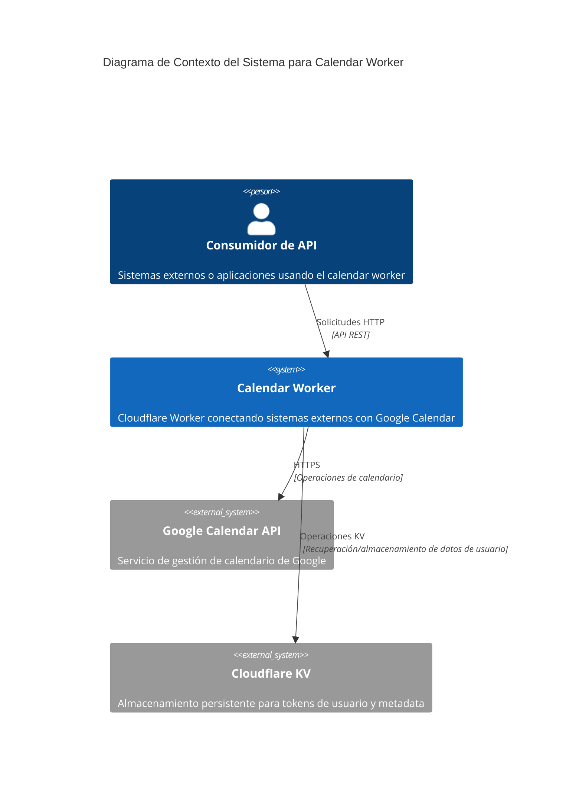

# Documento de Diseño de Software

## 1. Descripción General

### 1.1 Propósito
Este documento especifica el diseño de software para la funcionalidad de creación de eventos de calendario dentro del sistema calendar-worker, habilitando la creación programática de eventos en Google Calendar a través de un endpoint de API REST.

### 1.2 Alcance
El diseño cubre la implementación del endpoint POST /calendar/events, incluyendo validación, autorización, transformación de datos e integración con Google Calendar API v3.

### 1.3 Audiencia Objetivo
- Ingenieros de software implementando la funcionalidad
- Arquitectos de sistemas revisando el diseño
- Ingenieros de QA desarrollando casos de prueba
- Ingenieros de DevOps configurando el despliegue

## 2. Alcance

### 2.1 Dentro del Alcance
- Diseño del endpoint de API para creación de eventos
- Validación y sanitización de solicitudes
- Integración OAuth 2.0 con Google Calendar API
- Manejo de errores y formateo de respuestas
- Auditoría y observabilidad
- Sistema de categorización de tipos de eventos

### 2.2 Fuera del Alcance
- Modificación o eliminación de eventos
- Operaciones de gestión de calendarios
- Operaciones masivas de eventos
- Notificaciones en tiempo real
- Gestión de invitaciones por email fuera del sistema de Google

## 3. Definiciones

| Término | Definición |
|---------|------------|
| Tipo de Evento | Clasificación categórica de eventos de calendario (reunión, cita, etc.) |
| ID de Calendario | Identificador único de Google Calendar para instancias específicas de calendario |
| RFC3339 | Estándar de formato de fecha-hora usado para solicitudes de API |
| RRULE | Formato de regla de recurrencia siguiendo el estándar RFC5545 |
| KV Store | Almacenamiento clave-valor de Cloudflare para datos de sesión de usuario |
| Versión del Worker | Identificador de versión semántica para el despliegue de calendar-worker |

## 4. Supuestos y Restricciones

### 4.1 Supuestos
- Los usuarios han completado el flujo OAuth 2.0 con los scopes apropiados
- Google Calendar API v3 permanece estable y disponible
- Los datos de zona horaria del usuario por defecto son "America/Santiago"
- Los permisos de calendario son gestionados a través del sistema de Google
- KV store mantiene 99.9% de disponibilidad

### 4.2 Restricciones
- Máximo 100 asistentes por evento (límite de Google Calendar API)
- Duración de evento limitada a 24 horas excepto eventos de todo el día
- Límite de 1000 eventos por usuario por día
- Tiempo de respuesta debe ser menor a 5 segundos
- Límite de memoria de 128MB de Cloudflare Workers
- Límite de timeout de ejecución de 30 segundos

## 5. Contexto del Sistema (C4 - Nivel 1)



## 6. Visión de Arquitectura

### 6.1 Estilo Arquitectónico
API RESTful siguiendo principios de Clean Architecture con separación de responsabilidades entre capas de presentación, lógica de negocio y acceso a datos.

### 6.2 Límites del Sistema
La funcionalidad de creación de eventos opera dentro del sistema calendar-worker existente, interfaceando con la API externa de Google Calendar y el almacenamiento interno KV.

### 6.3 Atributos de Calidad Críticos
- **Seguridad**: Autenticación OAuth 2.0 y validación de entrada
- **Confiabilidad**: Manejo de errores y degradación elegante
- **Rendimiento**: Tiempos de respuesta sub-5 segundos
- **Mantenibilidad**: Diseño modular con clara separación de responsabilidades

## 7. Diseño de Componentes (C4 - Nivel 3)

```mermaid
C4Component
    title Diagrama de Componentes para Creación de Eventos

    Container(worker, "Calendar Worker", "TypeScript", "Runtime de Cloudflare Workers")
    
    Component(router, "Router de Solicitudes", "TypeScript", "Enruta POST /calendar/events al manejador de eventos")
    Component(validator, "Validador de Entrada", "TypeScript", "Valida estructura de solicitud y reglas de negocio")
    Component(auth, "Manejador de Autenticación", "TypeScript", "Gestiona tokens OAuth y verificación de usuario")
    Component(transformer, "Transformador de Datos", "TypeScript", "Convierte solicitudes de API al formato de Google Calendar")
    Component(calendar, "Servicio de Calendario", "TypeScript", "Integración con Google Calendar API")
    Component(logger, "Logger de Auditoría", "TypeScript", "Logging estructurado para operaciones")
    
    ComponentsDb(kv, "KV Store", "Cloudflare KV", "Tokens de usuario y metadata")
    ComponentsDb(google_api, "Google Calendar API", "REST API", "Endpoint de creación de eventos")

    Rel(router, validator, "Payload de solicitud")
    Rel(validator, auth, "Solicitud validada")
    Rel(auth, kv, "Búsqueda de usuario")
    Rel(auth, transformer, "Solicitud autenticada")
    Rel(transformer, calendar, "Payload de Google API")
    Rel(calendar, google_api, "HTTPS POST")
    Rel(calendar, logger, "Metadata de operación")
```

## 8. Modelo de Datos

### 8.1 Estructura de Datos de Entrada
```typescript
interface EventCreationRequest {
  calendar_id: string;           // Requerido: Identificador de calendario objetivo
  summary: string;              // Requerido: Título del evento (máx 1024 chars)
  start: DateTimeSpec;          // Requerido: Fecha/hora de inicio
  end: DateTimeSpec;            // Requerido: Fecha/hora de fin
  event_type: EventType;        // Requerido: Enum de categorización
  description?: string;         // Opcional: Descripción del evento
  location?: string;            // Opcional: Ubicación física/virtual
  attendees?: AttendeeSpec[];   // Opcional: Participantes invitados
  reminders?: ReminderSpec;     // Opcional: Configuración de notificaciones
  recurrence?: string[];        // Opcional: Patrones RRULE
  visibility?: VisibilityType;  // Opcional: Configuración de privacidad
  status?: EventStatus;         // Opcional: Estado inicial
}
```

### 8.2 Taxonomía de Tipos de Eventos
| Categoría | Tipos | Cantidad |
|-----------|-------|----------|
| Trabajo | meeting, presentation, workshop, conference-call, review, planning, standup | 7 |
| Personal | appointment, personal, family, social, travel, vacation | 6 |
| Proyecto | deadline, milestone, launch, deployment | 4 |
| Especial | all-day, recurring, reminder, blocked-time | 4 |

### 8.3 Estructura de Datos de Respuesta
```typescript
interface EventCreationResponse {
  id: string;                   // Identificador de evento de Google
  status: string;               // Estado del evento
  html_link: string;            // Enlace web de Google Calendar
  created: string;              // Timestamp de creación
  updated: string;              // Timestamp de última modificación
  summary: string;              // Título del evento
  calendar_info: CalendarInfo;  // Metadata del calendario
  event_metadata: WorkerMetadata; // Datos específicos del worker
}
```

## 9. Contratos de API

### 9.1 Especificación del Endpoint
- **Método**: POST
- **Ruta**: /calendar/events
- **Content-Type**: application/json
- **Autenticación**: header x-user-id (requerido)

### 9.2 Códigos de Respuesta
| Código | Significado | Condiciones |
|--------|-------------|-------------|
| 201 | Created | Evento creado exitosamente |
| 400 | Bad Request | Datos de entrada inválidos o falla de validación |
| 401 | Unauthorized | Header x-user-id faltante o inválido |
| 403 | Forbidden | Permisos de calendario insuficientes |
| 404 | Not Found | Usuario o calendario no encontrado |
| 409 | Conflict | Conflicto de franja horaria detectado |
| 500 | Internal Server Error | Error de Google API o del sistema |

### 9.3 Formato de Respuesta de Error
```typescript
interface ErrorResponse {
  error: {
    message: string;
    details?: ValidationErrors | ConflictDetails | PermissionDetails;
  }
}
```

## 10. Requisitos No Funcionales

### 10.1 Requisitos de Rendimiento
- Tiempo de respuesta: < 5 segundos para eventos simples
- Tiempo de respuesta: < 8 segundos para eventos recurrentes
- Throughput: 100 solicitudes por segundo por instancia de worker
- Uso de memoria: < 64MB por solicitud

### 10.2 Requisitos de Confiabilidad
- Disponibilidad: 99.9% uptime
- Tasa de error: < 1% para solicitudes válidas
- Consistencia de datos: Sin creación parcial de eventos
- Degradación elegante en fallos de Google API

### 10.3 Requisitos de Seguridad
- Sanitización de entrada para todos los campos de texto
- Prevención de inyección SQL (N/A para este sistema)
- Prevención XSS en datos de respuesta
- Sin datos sensibles en logs o mensajes de error
- Rate limiting: 1000 eventos por usuario por día

### 10.4 Requisitos de Usabilidad
- Mensajes de error claros con guía accionable
- Formato de respuesta consistente en todos los endpoints
- Validación de campo completa con códigos de error específicos

## 11. Consideraciones de Seguridad

### 11.1 Autenticación y Autorización
- Validación de token OAuth 2.0 para cada solicitud
- Verificación de permisos de Google Calendar antes de creación de evento
- Aislamiento de contexto de usuario a través de validación de header x-user-id

### 11.2 Validación de Entrada
- Límites de longitud de campo para prevenir buffer overflow
- Validación de formato de email para asistentes
- Validación de formato de fecha/hora (RFC3339)
- Validación de patrón RRULE contra RFC5545
- Sanitización de tags HTML/script en campos de texto

### 11.3 Protección de Datos
- Sin almacenamiento de datos sensibles de usuario en memoria del worker
- Redacción de tokens en todas las salidas de log
- Transmisión segura usando solo HTTPS
- Retención mínima de datos en KV store

## 12. Riesgos y Compromisos

### 12.1 Riesgos Técnicos
| Riesgo | Impacto | Mitigación |
|--------|---------|------------|
| Límites de rate de Google API | Alto | Implementar backoff exponencial y cola de solicitudes |
| Expiración de token OAuth | Medio | Manejo automático de refresh token |
| Indisponibilidad de KV store | Alto | Degradación elegante con respuestas de error |
| Procesamiento de payload grande | Medio | Límites de tamaño de solicitud y manejo de timeout |

### 12.2 Compromisos de Negocio
- **Simplicidad vs Características**: Limitado solo a Google Calendar, sin soporte multi-proveedor
- **Rendimiento vs Validación**: Validación completa añade latencia pero mejora confiabilidad
- **Flexibilidad vs Seguridad**: Tipos de eventos fijos reducen flexibilidad pero mejoran consistencia de datos

### 12.3 Riesgos Operacionales
- **Complejidad de despliegue**: Nueva lógica de validación requiere pruebas exhaustivas
- **Gaps de monitoreo**: Métricas adicionales necesarias para operaciones de creación de eventos
- **Mantenimiento de documentación**: Cambios de API requieren actualizaciones sincronizadas de documentación

## 13. Preguntas Abiertas

### 13.1 Preguntas Técnicas
- ¿Deberíamos implementar control de concurrencia optimista para eventos en conflicto?
- ¿Cómo deberíamos manejar fallos parciales en operaciones masivas (mejora futura)?
- ¿Cuál es el TTL apropiado de caché para datos de permisos de calendario?

### 13.2 Preguntas de Negocio
- ¿Deberían los tipos de eventos ser configurables por usuario/organización?
- ¿Cuáles son los requisitos para trails de auditoría de modificación de eventos?
- ¿Cómo deberíamos manejar conflictos de zona horaria entre usuario y configuración de calendario?

### 13.3 Preguntas de Integración
- ¿Necesitaremos notificaciones webhook para eventos creados?
- ¿Deberíamos soportar campos personalizados más allá del estándar de Google Calendar?
- ¿Cómo se integrará esto con potenciales proveedores de calendario futuros?

---

**Versión del Documento**: 1.0  
**Última Actualización**: 2024-03-15  
**Estado de Revisión**: Borrador  
**Aprobado Por**: [Pendiente de Revisión]